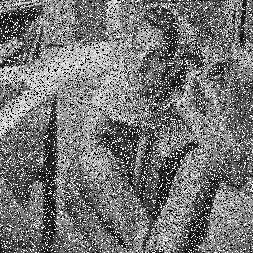

# Median_Filter_Verilog

I use Verilog to do [Median Filter](https://en.wikipedia.org/wiki/Median_filter#:~:text=The%20median%20filter%20is%20a,edge%20detection%20on%20an%20image) and [DE1-SoC Board](https://www.terasic.com.tw/cgi-bin/page/archive.pl?Language=English&No=836) 

All report in [docs](docs)

## Result

Noisy image

Fill

Noisy image

Fill

